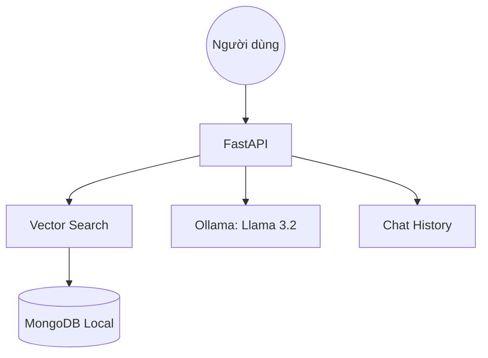

# 🪨 Chatbot Gành Đá Đĩa - Local RAG System

Hệ thống Chatbot thông minh hỗ trợ tìm kiếm và giải đáp thông tin về danh thắng **Gành Đá Đĩa (Phú Yên)**, sử dụng kiến trúc **RAG (Retrieval-Augmented Generation)** chạy hoàn toàn local.

## 🌟 Tính năng
- **Local RAG:** Không phụ thuộc vào API bên thứ ba, đảm bảo quyền riêng tư và tốc độ.
- **Vector Search:** Sử dụng MongoDB Atlas Local để tìm kiếm ngữ nghĩa chính xác.
- **LLM:** Tích hợp Llama 3.2 (via Ollama) để sinh câu trả lời tự nhiên bằng tiếng Việt.
- **Context-Aware:** Ghi nhớ lịch sử hội thoại để trả lời theo ngữ cảnh.
- **Cấu hình linh hoạt:** Quản lý qua biến môi trường (.env).

## 🏗️ Kiến trúc hệ thống
Hệ thống bao gồm các thành phần chính:
1. **FastAPI Backend:** Xử lý yêu cầu và điều phối luồng RAG.
2. **MongoDB Atlas Local:** Lưu trữ văn bản và thực hiện Vector Search.
3. **Ollama:** Cung cấp Embeddings (`nomic-embed-text`) và LLM (`llama3.2`).



## 🚀 Hướng dẫn cài đặt

### 1. Yêu cầu hệ thống
- Docker & Docker Desktop.
- Ollama (tải tại [ollama.com](https://ollama.com)).
- Python 3.11.

### 2. Thiết lập môi trường
Tạo môi trường ảo và cài đặt thư viện:
```bash
conda create --prefix ./chatbot_env python=3.11 -y
conda activate ./chatbot_env
pip install -r requirements.txt
```

### 3. Khởi động Database (Docker)
```bash
docker-compose up -d
```

### 4. Chuẩn bị Mô hình AI (Ollama)
```bash
ollama pull llama3.2
ollama pull nomic-embed-text
```

### 5. Nạp dữ liệu (Ingestion)
```bash
python ingest/ingest_data.py
```

## 💻 Sử dụng

### Khởi động API Server
```bash
python -m uvicorn app.main:app --host 0.0.0.0 --port 8000
```

### API Endpoints
- **POST `/chat`**: Gửi câu hỏi và nhận câu trả lời.
  ```json
  {
    "message": "Gành Đá Đĩa ở đâu?"
  }
  ```
- **GET `/docs`**: Tài liệu API tương tác (Swagger UI).

## 🛡️ Bảo mật
Dự án đã được tối ưu hóa để không lộ thông tin nhạy cảm. Toàn bộ cấu hình được quản lý qua file `.env` (không đẩy lên GitHub). Hãy sử dụng file `env.example` làm mẫu.

---
**Author:** nltrinh  
**Project:** Chatbot-GanhDaDia-RAG
